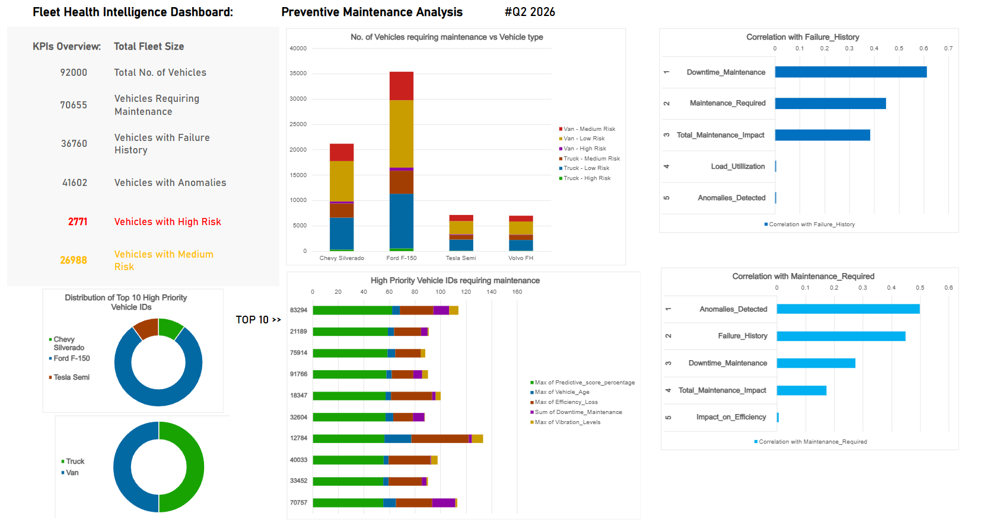

# Fleet Health Intelligence Dashboard: Predictive Maintenance Analytics for Logistics Operations 

  

---
<h3>Overview</h3>

Logistics companies operate large fleets of vehicles that must stay on the road to meet delivery commitments. When a vehicle fails unexpectedly, the consequences ripple across the entire operation — missed delivery windows, emergency repair costs, extended downtime, reduced fleet utilization, and unhappy customers.

Fleet Health Intelligence Dashboard is a predictive maintenance analytics project that uses vehicle telemetry, sensor data, and historical maintenance records to identify which vehicles are at risk of failure before it happens — enabling proactive, cost-effective fleet management.

---
<h3>Problem Statement</h3>

A logistics company operates thousands of vehicles across multiple routes and conditions. Unexpected vehicle failures lead to:
Delivery delays — missed SLAs and disrupted schedules
Increased repair costs — emergency repairs are more expensive than planned ones
Vehicle downtime — vehicles off the road mean lost capacity
Lower fleet utilization — fewer vehicles available for active routes
Customer dissatisfaction — late or failed deliveries damage trust

Key Questions
1. Which vehicles are most likely to require maintenance?
2. What factors contribute most to failures?
3. How can maintenance be prioritized?
4. Where can the company reduce cost and downtime?

---
<h3>Dataset</h3>

Logistics Vehicle Maintenance History Dataset
https://www.kaggle.com/datasets/datasetengineer/logistics-vehicle-maintenance-history-dataset

Description:
The dataset contains 250,000 records simulating real-time IoT-enabled logistics fleet data, covering vehicle specifications, operating conditions, sensor readings, diagnostic signals, historical maintenance information, communication-interface attributes, and derived health indicators.

It supports both binary (Maintenance_Required) and multiclass (Maintenance_Severity) predictive maintenance tasks, and includes predefined train/validation/test splits along with simulated federated learning client assignments (non-IID Dirichlet partitioning) — making it suitable for centralized ML, edge-AI, and privacy-preserving federated learning experiments.

---
Tool used: Microsoft Excel 365
- Data Processing: Power Query (data cleaning, transformation, merging)
- Analysis: Advanced Excel formulas — XLOOKUP, INDEX/MATCH, SUMIFS/COUNTIFS/AVERAGEIFS, IFS, dynamic arrays (FILTER, SORT, UNIQUE)
- Modeling Layer: PivotTables, PivotCharts
- Dashboard: Native Excel dashboard sheet
